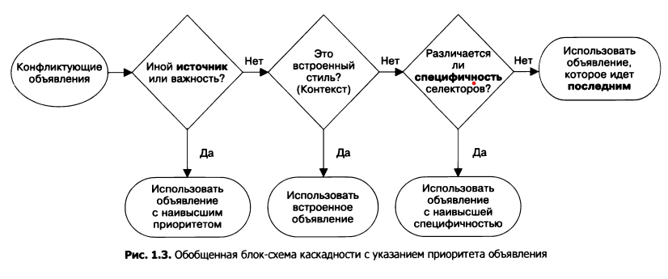

# Каскадность

*Каскадность* — это механизм, благодаря которому к элементу HTML-документа может применяться более чем одно правило CSS.

Когда объявления конфликтуют, для устранения проблемы нужно учесть три показателя:
1. Источник стилей — место расположения (созданные стили накладываются на браузерные).
2. Специфичность селекторов — то, какте селекторы имеют приоритет над другими.
3. Исходный порядок — порядок, в кором стили объявляются в таблице стилей.

Блок-схемма порядка решения конфликтов:



## Источник стилей

Созданые для сайта стилями называются *авторскими*. Некторые браузеры позволяют определять свои стили — это третий источник стилей, который занимает промежуточное место в приоритетности: сначала учитываются авторские, затем, если есть изменённые браузерные, а в конце — браузерные по-умолчанию.

> **Примечание**
> 
> Есть ещё одна возможность задать стили — это атрибуты HTML. Для браузера они имеют приоритет выше даже авторских стилей. Но для стилизации атрибуты использовать не стоит по той причине, по которой CSS отделяется от HTML-разметки в отдельный файл.

Представленную выше иерархию можно нарушить при помощи ключевого слова ***important***, например:

```CSS
.anymore {
   color: red !important;
}
```
Таким образом *важные авторские стили* выходят на первое место в приоритете. 


Предположим в одном источнике правил появляется конфликт. В  таком случае будет учитываться специфичность.

Браузер оценивает специфичность в два этапа:
1. Проверяет стили, встроенные в HTML-код (*строчные* — о них было примечание выше)
2. Проверяет стили, применемые с помощью стелекторов.

## Специфичность селекторов

О селекторах [здесь.](../selectors/main.md)

Например, селектор с двумя классами более специфичен, чем с одним (или селектор состоящий из иденификатора и тега).

```css 
#main-nav a {
   color: white;
   background-color: #13a4a4;
   padding: 5px;
   border-radius: 2px;
   text-decoration: none;
}

.featured {
   background-color: orange;
}
```
В данном случае цвет не поменяется, если этемент будет таким:

```html
<header class="page-header">
   <h1 id="page-title" class="title">Профессиональная техника для обжарщиков</h1>
   <nav>
      <ul id="main-nav" class="nav">
         <li><a href="#">Главная</a></li>
         <li><a href="#">Ростеры</a></li>
         <li><a href="#">Кофеварки</a></li>
         <li><a href="#" class="featured">Акции!</a></li>
      </ul>
   </nav>
</header>
```

Причина в том, что первый селектор здесь специфичнее, чем второй - из класса.

Различные типы селекторов также имеют свои особенности: селектор идентификатора специфичнее селектора класса или нескольких классов, а селектор класса специфичнее селектора тега (*селектора типа*).

Правила (иерархия на понижение):
1. Наиболее специфичным будет селектор с идентификаторами: чем больше идентификаторов, тем более специфичным будет селектор.
2. Селектор с наибольшим количеством классов.
3. Селектор с наибольшим количеством тегов.

> **Примечание**
> 
> Селкторы псевдоклассов и селекторы атрибутов специфичны в той же степени, что и селектор класса. Книверсальный селектор (*) и комбинаторы (>, +, ~) не влияют на специфичность.

Подводным камнем специфичности является вероятность создать такой селектор, который трудно будет переопределить. Если нужно переопределить стиль, применённый с помощью селектора идентификатора, придётся использовать другой идентификатор.

### Рассчёт специфичности

Специфичность выражается в числовой форме через запятую. Первая цифра — это количество идентификаторов, вторая — классов и третья — тегов (то есть в порядке уменьшения приоритета):

> **"1,2,2"** означает один идентификатор, два класса и два тега 

Сравнение чисел здесь получается по математическому принципу:

**2,2,2 > 1,2,2 > 0,2,2**

Получается, что в примере первый селектор имеет специфичность **1,0,1**, а второй — **0,1,0**

### Практическое определение стилей, с применением специфичности

#### Способ 1

В свойстве второго селектора (```.featured```) поставить ключевое слово ```!impotant```. Минусом данного способа является вероятность в будущем установить для другого селектора специфичность выше той, которая определяется нами в данном свойстве.

#### Способ 2

Повысить специфичность второго селектора. В нашем случае вместо ```.featured``` написать:

```css
#main-nav .featured {
   background-color: orange;
}
```

Данный способ хорош, но, возможно у первого селектора слишком высокая специфичность из-за которой и появляются проблемы с определением правил.

#### Способ 3

Понизить специфичность первого селектора. Его HTML-код: ```<ul id="main-nav" class="nav">```. Для него мы пишем селектор ```#main-nav a```. Вот как раз вместо ```#main-nav``` можно написать селектор класса ```.nav``` и таким образом вместо специфичности 1,0,1 получить 0,1,1.

В итоге мы должны получить для представленной выше HTML-разметки следующий CSS-код

```css
h1 {
   color: #2f4f4f;
   margin-bottom: 10px;
}
.nav {
   margin-top: 10px;
   list-style: none;
   padding-left: 0;
}
.nav li {
   display: inline-block;
}
.nav a {
   color: white;
   background-color: #13a4a4;
   padding: 5px;
   border-radius: 2px;
   text-decoration: none;
}

.nav .featured { /*Специфичность получается 0,2,0*/
   background-color: orange;
}
```
## Исходный порядок

Вполне вероятно, что источник и уровень специфичности могут оказаться одинаковыми.

В таком случае объявление, которое указано в таблице стилей позже или находится в таблице стилей, на которую ссылаются позже имеет больший приоритет. (В данном случае побеждает последний :-)) 

Соответственно третий вариант решения поставленной задачи может выглядеть так:

```css
.nav a {
   color: white;
   background-color: #13a4a4;
   padding: 5px;
   border-radius: 2px;
   text-decoration: none;
}

a.featured { 
   background-color: orange;
}
```

Слабой стороной данного варианта решения является вероятность применить класс ```featured``` к другой ссылке в другой позиции страницы вне **nav**.

### Форматирование ссылок и исходный порядок

Селекторы для форматирования ссылок следует указывать в определённом порядке. Правлитьный порядок:

```css 
a:link {
   color: blue;
   text-decoration: none;
}

a:visited {
   color: purple;
}

a:hover {
   text-decoration: underline;
}

a:active {
   color: red;
}
```

Иными словами, порядок такой: ***непосещённая***, ***посещённая, наведение, активная***

### Каскадные значения

Объявеление, которое "побеждает" в конце концов и которое применяется к элементу называется *каскадным значением*. Если свойство для элемента не указано, то он не имеет каскадного значения для этого свойства.

[Следующая статья](inheritance.md)