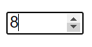
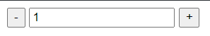
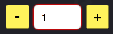

# Счётчик для числовых значений

Есть специальный вид инпутов — ```<input type="number">```. С атрибутами начала числового диапазона и конца (```min="10" max="100"```), он формирует следующий числовой счётчик:

 

Это не всегда допустимо, так как стрелочки не самые крупные и, к тому же, в мобильной версии Chrome пропадают стрелочки (в мобильном Mozilla Firefox стрелочки есть, но чтобы "попасть" на нужную, следует увеличить страницу до конских размеров). Поэтому каким-либо образом нужно постараться прийти к такому результату (или подобному):


[Здесь](https://qna.habr.com/q/350012) есть коротенькое обсуждение этого вопроса.

**Первый ответ** — это решение при помощи такого кода:

***HTML:***

```html
<div class="counter">
  <button type="button" class="but counterBut dec">-</button>
  <input type="text" class="field fieldCount" value="1" data-min="1" data-max="20">
  <button type="button" class="but counterBut inc">+</button>
</div>
```
***JavaScript:***
```js
function catalogItemCounter(field){
			
   var fieldCount = function(el) {

      var 
         // Мин. значение
         min = el.data('min') || false,

         // Макс. значение
         max = el.data('max') || false, 

         // Кнопка уменьшения кол-ва
         dec = el.prev('.dec'), 

         // Кнопка увеличения кол-ва
         inc = el.next('.inc');

      function init(el) {
         if(!el.attr('disabled')){
            dec.on('click', decrement);
            inc.on('click', increment);
         }

         // Уменьшим значение
         function decrement() {
            var value = parseInt(el[0].value);
            value--;

            if(!min || value >= min) {
               el[0].value = value;
            }
         };

         // Увеличим значение
         function increment() {
            var value = parseInt(el[0].value);
               
            value++;

            if(!max || value <= max) {
               el[0].value = value++;
            }
         };
         
      }

      el.each(function() {
         init($(this));
      });
   };

   $(field).each(function(){
      fieldCount($(this));
   });
}
    
catalogItemCounter('.fieldCount');
```

Понятно, что придётся подключать jQuery и работать с JS, но результат вполне универсален и функционален:



**Второй ответ** предлагает использовать [NumberPlugin](https://number-plugin.ru/). Результат его применения:



Большой минус - это опять же, зависимость от jQuery. 

## Вывод

Нужно написать свой на чистом JavaScript. И ещё по этой статье: переделать все .PNG в .SVG :-)
