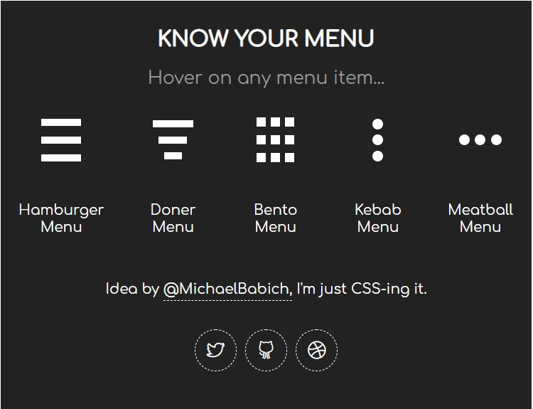

[НА ГЛАВНУЮ](../../README.md)/[К СПИСКУ](../elem_of_interface.md)

# Меню 

## Ниспадающие меню
[Меню навигации CSS с рамкой при наведении](http://zornet.ru/load/menju_navigacii_css_s_ramkoj_pri_navedenii/84-1-0-10389)

## Меню аккордеоны
Смотрите [здесь](accord_des.md)

## Контекстное меню (popup menu)

[Атрибут contextmenu](http://htmlbook.ru/html/attr/contextmenu)
[Контекстное меню в Firefox](http://htmlbook.ru/blog/kontekstnoe-menyu-v-firefox) — статья от 06.02.2012 
 

[Создаем контекстное меню для сайта на JavaScript ](https://www.rudebox.org.ua/create-context-menu-to-site-to-js/) 
 

[Добавляем контекстное меню на веб-сайт при помощи HTML5 ](http://www.coolwebmasters.com/menu-and-navigation/5018-dobavlyaem-kontekstnoe-menyu-na-veb-sayt-pri-pomoschi-html5.html) 
 

## Радиальное меню
**Языки:** 

[Создание радиального меню в CSS ](https://overcoder.net/q/9250/%D1%81%D0%BE%D0%B7%D0%B4%D0%B0%D0%BD%D0%B8%D0%B5-%D1%80%D0%B0%D0%B4%D0%B8%D0%B0%D0%BB%D1%8C%D0%BD%D0%BE%D0%B3%D0%BE-%D0%BC%D0%B5%D0%BD%D1%8E-%D0%B2-css) 
 

[CSS радиальное меню](https://coderoad.ru/29104809/CSS-%D1%80%D0%B0%D0%B4%D0%B8%D0%B0%D0%BB%D1%8C%D0%BD%D0%BE%D0%B5-%D0%BC%D0%B5%D0%BD%D1%8E)
 
 

---

**Языки:** 
[Круговое Меню ](https://coderoad.ru/19328048/CSS3-%D0%9A%D1%80%D1%83%D0%B3%D0%BE%D0%B2%D0%BE%D0%B5-%D0%9C%D0%B5%D0%BD%D1%8E)
Ссылка на [исходники](http://jsfiddle.net/SNrAF/1/) 
 

[Making an animated radial menu with CSS3 and JavaScript ](http://creative-punch.net/2014/02/making-animated-radial-menu-css3-javascript/)

## Bento Menu, Döner Menu, Hamburger Menu, Kebab Menu, Alt-burger, meatball.
Типы иконок меню, которые названы в честь блюд. Используются очень часто в качестве отображения меню.

Работа анимации заключается в том, что в выпадающем блоке выводятся пункты меню, а сама икнока переходит в изображение крестика, который означает "закрыть меню".

[Анимированные CSS иконки меню: Hamburger, Doner, Bento, Kebab, Meatball ](https://nisnom.com/veb-razrabotki/animirovannye-css-ikonki-menyu-hamburger-doner-bento-kebab-meatball/) 
> Также на [этом](https://nisnom.com/) сайте можно найти много других эффектов как для гамбургеров, так и для разных видов меню, а также многих элементов UI.
