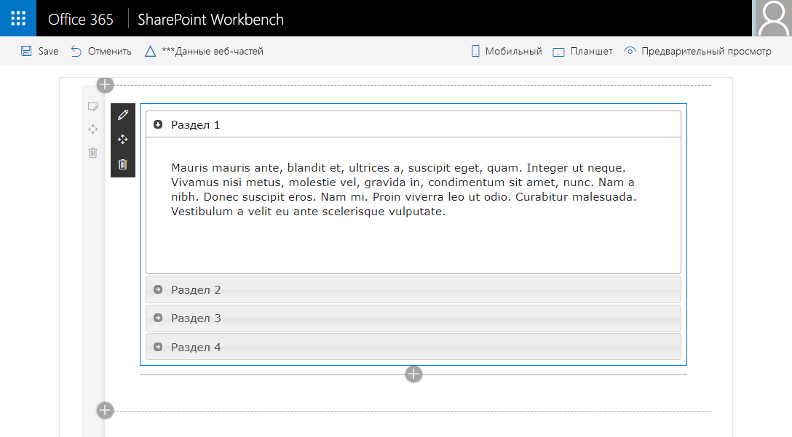
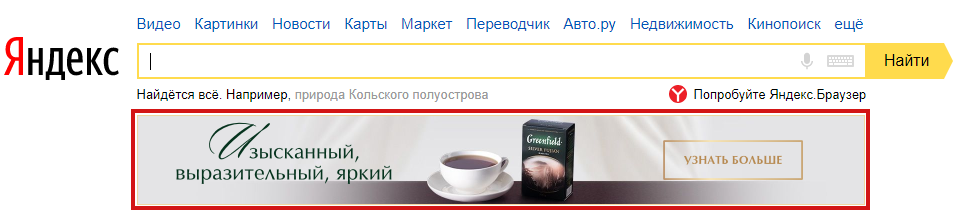

# Элементы интерфейса сайта

[Оригинал 1](https://borodaboroda.com/blog/elementy-interfejsa-sajta/)
[Оригинал 2](https://bool.dev/blog/detail/32-user-interface-elementov-dlya-ui-dizaynerov)

---

> #### Стоит ознакомиться:
>
> - [Портлет](https://ru.wikipedia.org/wiki/%D0%9F%D0%BE%D1%80%D1%82%D0%BB%D0%B5%D1%82)
> - [НАБОРЫ HTML UI ЭЛЕМЕНТОВ](https://postovoy.net/20-besplatnyh-naborov-html-ui-elementov-dlya-sayta.html)
> - [Ui интерфейс: Что такое UX/UI-дизайн и как попасть в эти профессии — статьи на Skillbox](https://art-nto.ru/raznoe/ui-interfejs-chto-takoe-ux-ui-dizajn-i-kak-popast-v-eti-professii-stati-na-skillbox.html#UI)
> - [53 технических термина, которые вам следует знать, как UX дизайнеру](https://ux.pub/53-texnicheskix-termina-kotorye-vam-sleduet-znat-kak-ux-dizajneru/)
> - [Словарь UX/UI терминов для недизайнеров](https://turumburum.ua/blog/slovar-ux-ui-terminov-dlya-nedizaynerov/)
> - [Основы иерархии в дизайне интерфейса (UI)](https://ux.pub/pochemu-nekotorye-dizayny-vyglyadyat-akkuratno-a-drugie-net/)
> - [UI controls на русском (Хабр)](https://habr.com/ru/post/223929/)

---

## UI элементы:

### Input Controls

>Input Controls позволяют пользователям вводить информацию в систему. Если вы хотите, чтобы ваши пользователи указывали, например, в какой стране они находятся, вы будете использовать элемент управления вводом, чтобы позволить им сделать это.

#### ***[Кнопка](design_of_elem/button_theo.md)*** 
[Все, что вам нужно знать о дизайне кнопок в интерфейсе](https://ux.pub/vse-chto-vam-nuzhno-znat-o-dizayne-knopok-v-interfeyse/)
[Кнопка для сайта: виды и способы создания](https://envybox.io/blog/knopka-dlja-sajta/)
Элемент, при нажатии на который происходит какое-то действие на сайте.
***Сдвоенная кнопка*** (split button) — кнопка, вызывающая список со вторичным(и) действием(и) (кнопками)
***Кнопка последовательного выбора***

#### ***[Счётчик](design_of_elem/input_type_number_des.md)***

Двунаправленный вариант для числовых значений. Нажатие на кнопку позволяет изменить значение параметра на единицу в большую или меньшую сторону.

  

### Navigation Components
> Navigation Components помогают пользователям перемещаться по продукту или веб-сайту. Общие навигационные компоненты включают панели вкладок на устройстве iOS и меню гамбургеров на Android.

  

#### ***[Аккордеоны (Accordion)](design_of_elem/accord_des.md)***

Аккордеоны позволяют пользователям расширять и сворачивать разделы контента. Они помогают пользователям быстро перемещаться по материалам и позволяют дизайнеру пользовательского интерфейса включать большие объемы информации в ограниченном пространстве.

#### ***[Меню (menu)](design_of_elem/menu_des.md)*** 

  

### Informational Components
> Informational Components делятся информацией с пользователями.

#### ***[Логотип](design_of_elem/logo_theo.md)***

К лого владельцы компаний подходят очень серьезно, и недаром: цель логотипа– не просто привлечь внимание клиента, но и запомниться ему. Удачный логотип – это то, что позволяет любому человеку сразу, с первого же взгляда, понять, в какой сфере работает организация и каковы ее особенности.

#### ***[Рекламный баннер](design_of_elem/advertising_banner_theo.md)***

#### ***[Счетчик посещаемости](design_of_elem/attendance_counterr_theo.md)***

Главная задача счетчика посещаемости — сбор статистики и показателей поведения пользователей посещающих ваш сайт: кто и когда заходил на сайт, что изучал, как долго просматривал страницы, заказал ли что-то на сайте. Данные отчетов служат лучшим индикатором того, полезен ли ваш сайт пользователю.

Посещаемость сайта — относительная метрика. Знание о посещаемости ресурса в момент времени не будет полезно. Оптимально сравнивать трафик в динамике (за недели, месяцы) или посещаемость сайтов между собой.

#### ***[Иконки](design_of_elem/icons_theo.md)***

Иконки — простейшие иллюстрации объекта или действия, это универсальный язык, который понятен каждому. Они ускоряют восприятие информации, поскольку считываются быстрее текста, хорошо запоминаются и помогают акцентировать внимание на ключевых моментах.

#### ***[Метка (label)](design_of_elem/label_theo.md)***

Правильно написанная метка делает работу с сайтом проще и приятнее, и повышает лояльность посетителей. Какие есть технические трудности работы с ними и варианты их исполнения? Материал заметки ответит на этот вопрос.
  

### Containers
> Containers содержат связанный контент вместе.

#### ***[Новостной блок](design_of_elem/news_theo.md)***
Новостной блок представляет собой ленту, в которой материалы размещены в хронологическом порядке. Как организовать подписку пользоваттеля на новости смотрите [здесь.](../func/suscr_fun.md) 

***

## НЕРАСПРЕДЕЛЁННОЕ:

#### ***[Индикатор уровня (Level Indicator)](design_of_elem/progres_elements.md)***
Элемент для индикации значения какой-либо величины. Иногда вместо него используется индикатор процесса, но некоторые руководства (к примеру, HIG от Apple[4]) запрещают подобную практику.

#### ***Radiobutton***
Позволяет пользователю выбрать одну опцию.

***Checkbox*** — позволяет выбрать несколько опций.

***Select*** — позволяет пользователю выбрать одну опцию из выпадающего списка.

***Accordeon*** — элемент интерфейса состоящий из заголовков и скрываемого и открываемого контента. 

***Слайдер*** — переключатель изображений (или другого контента) работающий автоматически или вручную.

***Контент*** — текст, изображения, видео, то есть наполнение сайта.

***Popup*** — небольшое всплывающее окно в углу экрана.

***Модальное окно*** — разновидность всплывающего окна. Оно появляется на большую часть экрана и блокирует работу с остальным сайтом. Это может быть форма обратной связи, или просмотр фотографий в вк и фейсбуке.

***Блок (Экран)*** — смысловой элемент включающий в себя информацию только об одной сущности. Обычно блок начинается с заголовка и отделен от следующего каким-либо визуальным решением, цветом, линией, тенью.

***Галерея*** — набор из нескольких изображений.

***Превью (preview)*** — изображение или часть другого контента, уменьшенная в размере. При нажатии на превью открывается исходный размер контента, отображаемого в превью.

***Бордер*** — обводка элемента. Бывает solid (цельной), dashed (линиями) и dotted (точками).

***Тултип (tooltip)*** — подсказка, всплывающая при наведении на элемент.

***Курсор Поинтер (Pointer)*** — тип курсора в виде руки с вытянутым указательным пальцем. Обычно появляется при наведении на ссылку.

***Курсор Текст (Text)*** — тип курсора, стандартный для редактирования текста.

***Навигация*** — любой вид элементов позволяющий перенаправлять пользователя на похожий элемент будь то страница, другая картинка, следующий текст и так далее.

***Пагинация*** — нумерация страниц, обычно отображенная как навигация в конце страницы.

***Списки*** — в веб интерфейсах присутствуют нумерованные списки (цифрами), маркированные списки (точки, квадратики, кружки, черточки) и списки определений.

***дерево*** — иерархический список (tree view)
***раскрывающийся список*** (combo box, drop-down list)

***Стрелочки*** — вид навигации.

***Поисковая строка*** — строка для ввода поискового запроса.

***Плеер*** — элемент воспроизводящий аудио и видеофайлы.

***Ползунок*** — предназначен для ввода чисел в указанном диапазоне.

***Текстовое поле*** — поле для ввода текстовых значений.

***Поле пароля*** — поле для ввода пароля. Автоматически скрывает символы, заменяя их на точки.

***Маска*** — это значения, указывающие формат допустимых значений входных данных в поле. 

***Ссылка*** — элемент интерфейса перенаправляющий вас по адресу, указанному в нем.

***Якорь*** — элемент интерфейса перенаправляющий вас по адресу и к конкретному элементу, указанному в нем.

***Вкладки (табы)*** — элемент интерфейса, так же как и аккордеон, состоит из заголовка и скрытого контента, на который можно попасть при обращении к заголовку.

***Строка загрузки*** — элемент, показывающий степень загрузки контента или исполняемой функции.

***Переключатель (switch)*** — элемент интерфейса, который позволяет выбрать одно из состояний, чаще всего вкл/выкл.

***Алерт окно*** — всплывающее окно, блокирующее взаимодействие пользователя не только с элементами на данной страницы, но и в целом со всем браузером.

***Прелоадер (Preloader)*** — анимированный элемент, воспроизводящийся в процессе загрузки сайта, видео, изображений и другого контента.

***Рейтинг (Rating bar)*** — элемент интерфейса показывающий среднюю оценку.

***Теги*** — элемент чаще всего располагающийся под контентом. Показывает принадлежность статьи, товара и пр. к конкретной категории. Зачастую при нажатии на тег, вы попадете на страницу со всем контентом, у которого есть такой тэг

***Хлебные крошки*** — навигационная цепочка — элемент интерфейса, показывающий путь от начала до того уровня, где в данный момент находится пользователь.

[SEO и хлебные крошки, виды](https://wiki.rookee.ru/menyu-kroshka/)

***Карточка***
Карточки на данный момент довольно популярны среди UI/UX. Карточки – это небольшие прямоугольные или квадратные модули, которые содержат различную информацию - в виде кнопок, текста, мультимедиа и т.д. Карточки - отличный выбор дизайна пользовательского интерфейса, если вы хотите разумно использовать доступное пространство и предоставить пользователю несколько вариантов содержимого, не заставляя их прокручивать традиционный список.

***Карусель (Carousel)***
Карусели позволяют пользователям просматривать наборы контента, такие как изображения или открытки, часто гиперссылки на большее количество контента или источников. Самым большим преимуществом использования каруселей в дизайне UI является то, что они позволяют нескольким фрагментам контента занимать одну и ту же область пространства на странице или экране. 

***Комментарий (Comment)***

***Dropdown***

***Лента (Feed)***

#### ***Форма (Form)***

***Поле редактирования*** (textbox, edit field)

[Про формы для подписки](https://www.unisender.com/ru/blog/novichkam/formy-podpiski/)

***Уведомления***

Нотификации дают юзеру понять, что есть что-то новое, например, сообщение или какое-то системное уведомление.

***Picker***
Преимущество использования пикеров над полями ввода  (input field) заключается в том, что все пользователи выбырают данные и они в нужном формате сохраняются в базе данных, что делает информацию управляемой и легкой для доступа.  В инпуте ж нужно писать парсеры и распознаватели разных типов введенных данных.

***Stepper***
Stepper - это элементы управления, которые позволяют пользователям регулировать значение. Однако, в отличие от ползунков, они позволяют пользователям изменять значение только в заранее определенных диапазонах, с заранее установленым шагом.

***Tooltip***
Tooltip - это небольшие подсказки, которые помогают пользователям понять часть или процесс в интерфейсе.

***Toggle***
Toggle это флаг который позволяет выбрать между Да или Нет.

